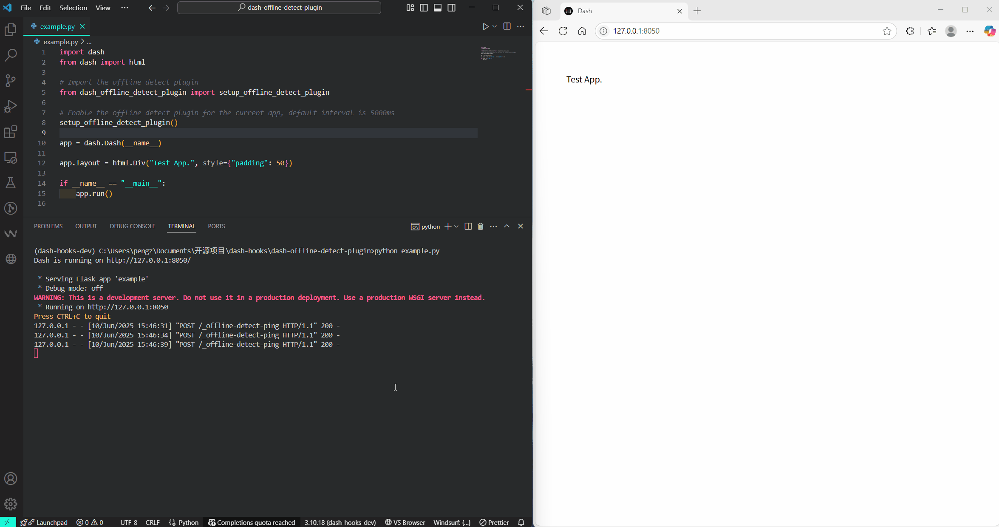

# dash-offline-detect-plugin

[](https://github.com/CNFeffery/dash-offline-detect-plugin/blob/main/LICENSE)
[](https://pypi.org/project/dash-offline-detect-plugin/)
[](https://github.com/astral-sh/ruff)

简体中文 | [English](./README.md)

适用于[Dash](https://github.com/plotly/dash)应用的离线检测插件，基于`Dash Hooks`实现，用于检测当前应用是否离线。

## 安装

```bash
pip install dash-offline-detect-plugin
```

## 使用

```python
from dash import Dash

# 导入插件启用函数
from dash_offline_detect_plugin import setup_offline_detect_plugin

# 为当前应用启用插件
setup_offline_detect_plugin()

app = Dash(__name__)

# 其他应用代码...
```

## 示例

执行示例应用：

```bash
python example.py
```

<center></center>

## 参数说明

### `setup_offline_detect_plugin()`

用于为当前`Dash`应用启用离线检测功能：

| 参数          | 类型  | 默认值                                                               | 描述                                                                 |
| ------------- | ----- | -------------------------------------------------------------------- | -------------------------------------------------------------------- |
| `interval`    | `int` | `5000`                                                               | 浏览器端检测间隔（单位：毫秒），控制浏览器检查后端服务是否可用的频率 |
| `title`       | `str` | `"Service Unavailable"`                                              | 服务不可用时弹出的遮罩层标题内容                                     |
| `description` | `str` | `"Unable to connect to the backend service, trying to reconnect..."` | 服务不可用时弹出的遮罩层描述内容                                     |
